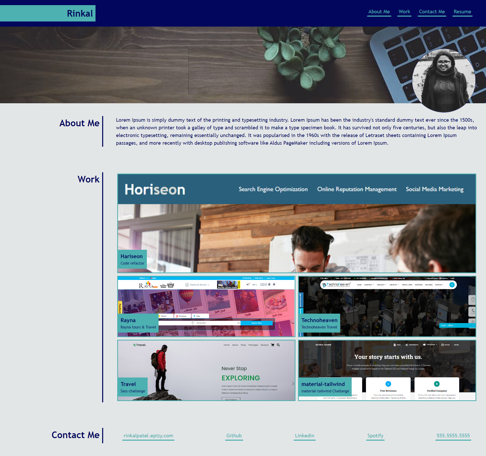
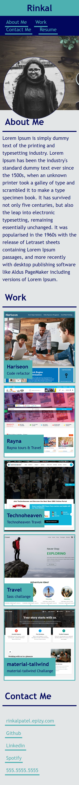

# Working With CSS Challenge: Portfolio

## Description

In this portfolio challnge you can show your skill and talents of your work, and add brief description about yourself. your projects and your contact detail as well,in this project  contain semantic HTML element, structure CSS styling with Grid css also, for responsive design we use media query as well.


## Installation

N//A
    
## Usage/Examples

The person who wants to check and learn about CSS grid styling and logical structure of independent styling and positioning and CSS reponsive design with media query can refere this code also to use this  code, you can review the topics of gril styling and media query from learning website.

## Screenshots







## Lessons Learned

. I learnd abot CSS Flexbox containers and set them to display as a row or a column.

. Position CSS Flexbox items inside containers to create clean and fluid layouts.

. Nest CSS Flexbox containers to control the elements contained inside them.

. Implement responsive CSS styles which react to changes on page

. Also, media queries in code to create a responsive grid layout.


## Credits
N/A


## Demo

Insert gif or link to demo


## Run Locally

Clone the project

```bash
  git clone https://link-to-project
```

Go to the project directory

```bash
  cd my-project
```

To open in visual studio

```bash
  code .
```


## License

Please refer to the LICENSE in the repo.

